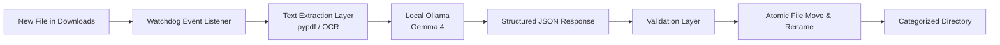

# SortSense — Gemma Local File Organizer

> An offline, privacy-first background service that automatically reads, semantically categorizes, and organizes incoming desktop and WhatsApp downloads using local **Gemma 4**.

## 👥 Team

**Team Name:** Brute Force

| Member | Contribution |
|---|---|
| **Dev Madhav** | File watcher daemon implementation (`watchdog`), OS directory routing |
| **Aadi UR** | Document extraction pipeline (`pypdf`, OCR) & metadata sanitization |
| **Jeevan T** | Local Gemma 4 integration, structured prompt engineering, Ollama client |
| **Rohith Singothu** | Frontend/dashboard interface, setup scripts, documentation & MLH submission |

---

## 🎯 Problem Statement

### The Problem

Every day, developers, students, and professionals receive tens of untracked files through messaging platforms such as WhatsApp and web browsers.

These files typically land in default `Downloads` directories with non-descriptive names such as:

```text
IMG-20261008-WA0004.pdf
DOC-WA0012.pdf
a8f31c92.pdf
```

Users end up wasting substantial time manually sorting, renaming, and searching through gigabytes of unorganized files.

### Why We Chose This Problem

Existing file organizers often rely on rigid rules based solely on file extensions:

```text
.pdf  → Documents/
.jpg  → Pictures/
.mp4  → Videos/
```

While this works at a basic level, it cannot understand the actual meaning of a document.

For example, two `.pdf` files could be:

- An electricity bill
- A university syllabus
- A bank statement
- A research paper
- A tax document

Cloud-based AI classification tools can provide semantic understanding, but they require users to upload potentially sensitive documents to external servers.

This creates serious privacy concerns when dealing with:

- Bank statements
- Identity documents
- Financial records
- University documents
- Proprietary files

**SortSense was built to solve this problem locally.**

---

## 💡 Solution

**SortSense** is a lightweight background daemon that monitors designated folders such as `Downloads` or `WhatsApp Received`.

When a new document arrives, SortSense:

1. Detects the new file using a filesystem event watcher.
2. Extracts its textual content.
3. Sends the extracted content to a locally running **Gemma 4** model through Ollama.
4. Generates a semantic category and human-readable filename.
5. Validates the structured response.
6. Automatically moves and renames the file into the appropriate local directory.

All processing happens locally on the user's machine.

---

## ✨ Key Features

### 🧠 Semantic Understanding

Classifies files based on their **actual content and context**, rather than relying only on file extensions.

### 🔒 100% Offline & Private

SortSense runs entirely on the local machine using **Gemma 4 + Ollama**.

> No documents, extracted text, or telemetry are sent to external servers.

### ✍️ Intelligent Auto-Renaming

Transforms opaque filenames such as:

```text
DOC-WA0012.pdf
```

into meaningful names such as:

```text
Electricity_Bill_September_2026.pdf
```

### ⚡ Low-Latency Background Watcher

Uses [`watchdog`](https://github.com/gorakhargosh/watchdog) to listen for filesystem events instead of continuously polling directories.

This allows SortSense to react to new files efficiently in the background.

---

## 🚀 Innovation & Differentiation

### Semantic vs. Syntactic Organization

Traditional file organizers typically use rules such as:

```text
if extension == ".pdf":
    move_to("Documents/")
```

SortSense instead considers the **semantic meaning** of the document.

For example:

```text
Electricity bill
        ↓
Gemma 4
        ↓
Utilities/
        ↓
Electricity_Bill_September_2026.pdf
```

### 🖥️ Local Edge Inference

Instead of uploading documents to cloud-based AI services, SortSense performs inference locally using the open-weight **Gemma 4** model.

This provides:

- Full data sovereignty
- Offline operation
- No cloud API costs
- Improved privacy
- No dependency on an internet connection

### 📦 Structured JSON Extraction

Gemma is instructed to return a constrained JSON structure containing the classification and filename.

Example:

```json
{
  "category": "Utilities",
  "filename": "Electricity_Bill_September_2026.pdf"
}
```

The response is then validated before any filesystem operation occurs.

This reduces the risk of malformed model output causing unsafe directory names or invalid filesystem operations.

---

## 🏗️ Technical Implementation

### Architecture



### Technology Stack

| Component | Technology |
|---|---|
| File System Monitoring | `watchdog` |
| PDF Extraction | `pypdf` |
| OCR | OCR pipeline |
| Local LLM | Gemma 4 |
| LLM Runtime | Ollama |
| Classification | Structured JSON prompting |
| File Operations | Native OS filesystem APIs |
| Frontend | Dashboard interface |

---

## 🔄 Processing Pipeline

```text
                    ┌─────────────────────┐
                    │   New File Arrives  │
                    └──────────┬──────────┘
                               │
                               ▼
                    ┌─────────────────────┐
                    │ Watchdog Listener   │
                    └──────────┬──────────┘
                               │
                               ▼
                    ┌─────────────────────┐
                    │ Content Extraction  │
                    │   PDF / OCR / Text  │
                    └──────────┬──────────┘
                               │
                               ▼
                    ┌─────────────────────┐
                    │   Local Gemma 4     │
                    │      via Ollama     │
                    └──────────┬──────────┘
                               │
                               ▼
                    ┌─────────────────────┐
                    │ Structured JSON     │
                    │ Validation          │
                    └──────────┬──────────┘
                               │
                               ▼
                    ┌─────────────────────┐
                    │ Rename & Move File  │
                    └──────────┬──────────┘
                               │
                               ▼
                    ┌─────────────────────┐
                    │ Categorized Folder  │
                    └─────────────────────┘
```

---

## 🔐 Privacy Model

SortSense is designed around a **local-first architecture**.

```text
┌──────────────────────────────────────────────┐
│              USER'S COMPUTER                │
│                                              │
│  Downloads                                   │
│      │                                       │
│      ▼                                       │
│  Watchdog                                    │
│      │                                       │
│      ▼                                       │
│  Text / OCR Extraction                       │
│      │                                       │
│      ▼                                       │
│  Local Ollama ──► Gemma 4                    │
│      │                                       │
│      ▼                                       │
│  Classification + Rename                    │
│      │                                       │
│      ▼                                       │
│  Organized Files                             │
│                                              │
└──────────────────────────────────────────────┘
                    │
                    │ No document uploads
                    ▼
             🌐 Internet
              NOT REQUIRED
```

---

## 🎯 Example

### Before

```text
Downloads/
├── IMG-20261008-WA0004.pdf
├── document.pdf
├── 938475.pdf
└── IMG-20261008-WA0012.pdf
```

### After SortSense

```text
Documents/
├── University_Syllabus_2026.pdf
└── Research_Paper_Edge_AI.pdf

Finance/
└── Bank_Statement_September_2026.pdf

Utilities/
└── Electricity_Bill_September_2026.pdf
```

The files are organized according to **what they actually contain**, rather than what their extensions happen to be.

---

## 🛠️ Core Workflow

```text
File Created
     │
     ▼
Filesystem Event
     │
     ▼
Content Extraction
     │
     ▼
Semantic Classification
     │
     ▼
JSON Validation
     │
     ▼
Safe Filename Generation
     │
     ▼
Atomic Move
     │
     ▼
Organized File
```

---

## 🌐 Offline by Design

SortSense does not require:

- Cloud AI APIs
- Internet connectivity
- External document-processing services
- Per-document API payments

The intelligence stays on the machine.

> **Your files shouldn't need a round trip to someone else's server just to find the right folder.**

---

## 👨‍💻 Team Brute Force

Built by **Team Brute Force** with a focus on privacy-preserving, local-first AI and practical automation.
