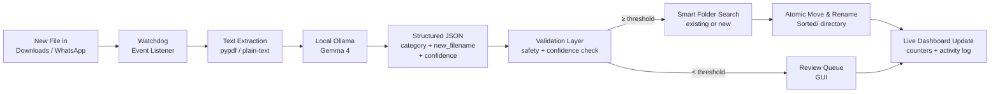

# SortSense — Gemma Local File Organizer

> An offline, privacy-first desktop application that automatically reads, semantically categorises, and organises incoming downloads using a locally running **Gemma 4** model — zero cloud, zero uploads.

## Team

**Team Name:** Brute Force

| Member | Contribution |
| ------ | ------------ |
| **Dev Madhav** | File watcher daemon (`watchdog`), multi-browser download path detection, OS directory routing, atomic file move & rename engine |
| **Aadi UR** | Document extraction pipeline (`pypdf`, plain-text / OCR), metadata sanitisation, GUI pipeline integration & live counter wiring |
| **Jeevan T** | Local Gemma 4 integration via Ollama, structured JSON prompt engineering, confidence-threshold validation layer |
| **Rohith Singothu** | CustomTkinter desktop dashboard (Obsidian/Emerald theme), setup scripts (`setup.sh` / `setup.bat`), documentation & MLH submission |

## Problem Statement

### The Problem

Every day, developers, students, and professionals receive dozens of untracked files through messaging platforms such as WhatsApp and web browsers. These files land in default `Downloads` directories with non-descriptive names:

```text
IMG-20261008-WA0004.pdf
DOC-WA0012.pdf
a8f31c92.pdf
```

Users waste substantial time manually sorting, renaming, and hunting through gigabytes of unorganised files.

### Why We Chose This Problem

Existing file organisers rely on rigid extension-based rules:

```
.pdf → Documents/    .jpg → Pictures/    .mp4 → Videos/
```

This cannot understand the *meaning* of a document — two `.pdf` files could be an electricity bill or a university syllabus. Cloud-based AI tools solve this but require uploading potentially sensitive documents (bank statements, identity papers, medical records) to external servers. **SortSense solves this locally.**

## Solution

SortSense is a lightweight background daemon combined with a live desktop dashboard. When a new document arrives in any watched folder:

1. **Detect** — `watchdog` fires a filesystem event instantly.
2. **Extract** — `pypdf` or plain-text extraction pulls the document's content.
3. **Classify** — Extracted text is sent to a locally running **Gemma 4** model via Ollama.
4. **Validate** — A deterministic Python validation layer checks the structured JSON response for safety and confidence.
5. **Organise** — The file is atomically renamed and moved into the correct category subfolder, with smart deduplication if the folder already exists.
6. **Display** — The desktop GUI updates its counters, Activity Log, and Review Queue in real time.

All processing stays on the user's machine.

### Key Features

- **Semantic understanding** — classifies by *content*, not just extension.
- **100% offline & private** — Gemma 4 runs via Ollama; no bytes leave the machine.
- **Intelligent auto-renaming** — transforms `DOC-WA0012.pdf` → `Electricity_Bill_September_2026.pdf`.
- **Smart folder matching** — finds and reuses an existing category folder instead of creating duplicates (e.g. puts a signals & systems PDF into an existing `Study_Notes/` folder).
- **Multi-browser watch** — auto-detects Chrome, Firefox, and OS-default download paths on both Windows and Linux.
- **Review Queue** — low-confidence files are surfaced in the GUI for manual one-click placement.
- **Live dashboard** — real-time Files Processed, Pending Review, and Model Status counters.

## Innovation and Differentiation

Traditional organisers match extensions. SortSense reads the document, asks a local LLM what it means, and files it semantically:

```
Electricity bill PDF  →  Gemma 4  →  Utilities/Electricity_Bill_September_2026.pdf
Signals & Systems notes  →  Gemma 4  →  Study_Notes/Signals_Systems_Semester_Notes.pdf
```

The key differentiators are:

- **Local edge inference** — open-weight Gemma 4 runs on-device; no API costs or internet dependency.
- **Confidence guardrails** — files below the configurable confidence threshold go to a Review Queue instead of being silently misplaced.
- **Structured + validated output** — Gemma is prompted for strict JSON; a Python layer blocks path-traversal characters, wrong extensions, and empty responses before any filesystem operation.
- **Smart existing-folder reuse** — scans the output directory for a matching subfolder before creating a new one, preventing fragmentation.

## Technical Implementation

### Architecture



### Technology Stack

| Category | Technologies |
| -------- | ------------ |
| Frontend | CustomTkinter desktop GUI (Obsidian/Emerald theme) |
| Backend | Python 3.13, Pydantic v2, `watchdog`, `shutil` |
| Database | N/A |
| AI / ML | Gemma 4 (`gemma4:e4b`) via Ollama, structured JSON prompting |
| Infrastructure | Local Ollama daemon, OS filesystem APIs |
| APIs / Services | N/A — fully offline |

### How It Works

| Layer | Module | Responsibility |
| ----- | ------ | -------------- |
| Watcher | `app/watcher.py` + `app/browser_paths.py` | Detects Chrome, Firefox & OS-default download paths; fires `FileEvent` on new files |
| Ingestion | `app/ingestion.py` | Extracts text from `.pdf`, `.txt`, `.md` using `pypdf` |
| Analyser | `app/analyzer.py` | Sends extracted text to Ollama, parses `DocumentAnalysis` JSON |
| Validation | `app/validation.py` | Blocks path-traversal, wrong extensions, null bytes; returns `ValidationResult` |
| Organiser | `app/organizer.py` | Maps `document_type` → category slug → `destination_folder`; computes safe filename |
| Router | `app/routing.py` + GUI smart search | Finds existing matching folder or creates new one; atomically moves + renames |
| GUI | `app/gui.py` | CustomTkinter dashboard; all pipeline results marshalled to Tk thread via `self.after()` |
| Config | `app/config.py` | Pydantic `Settings` singleton; all values overridable via env vars |

### Technical Decisions

- **Threading model** — the watcher fires events on a background thread; each file's pipeline runs on its own daemon thread; all Tkinter widget updates are marshalled back to the main thread via `self.after(0, ...)` to avoid race conditions.
- **Pydantic v2 for all data models** — `DocumentAnalysis`, `ValidationResult`, and `OrganizationDecision` are frozen Pydantic models, making invalid states unrepresentable.
- **Confidence threshold** — configurable via `FILEMIND_CONFIDENCE_THRESHOLD` env var (default `0.85`). Files below threshold are flagged for human review rather than silently misrouted.
- **Collision-safe moves** — destination files are never overwritten; the router appends `_1`, `_2` … suffixes automatically.
- **No FastAPI / no database** — keeping the stack minimal (pure Python + Tkinter + Ollama) means zero server processes and zero schema migrations.

## Implementation During the Hackathon

The team built SortSense end-to-end during the Hack Day, starting from zero. Major milestones completed:

- Full `watchdog`-based watcher with multi-browser path detection (Chrome `Preferences`, Firefox `prefs.js`, OS defaults) on both Linux and Windows.
- PDF / plain-text ingestion pipeline with safe content truncation.
- Gemma 4 Ollama integration with structured JSON prompting and retry handling.
- Deterministic validation layer catching hallucinations, path injections, and extension mismatches.
- Atomic file routing engine with smart existing-folder search.
- CustomTkinter desktop dashboard with live counters, Activity Log, Review Queue, and Settings page — all buttons fully wired.
- Automated installers (`setup.sh` / `setup.bat`) that configure the Python `.venv`, install dependencies, start Ollama, and pull the Gemma model.
- 89-test pytest suite covering all pipeline layers.

### Team Contributions

- **Dev Madhav:** Watcher daemon, `browser_paths.py`, config system, routing engine, smart folder search, CI/CD fixes.
- **Aadi UR:** Ingestion pipeline, GUI pipeline integration, live counter wiring, merge coordination.
- **Jeevan T:** Ollama client, Gemma prompting strategy, `analysis_models.py`, confidence validation.
- **Rohith Singothu:** CustomTkinter UI (Obsidian/Emerald theme), `setup.sh` / `setup.bat`, README, Devpost submission.

## Working Application

**Live Application:** N/A — SortSense is a local desktop application; it runs entirely on the user's machine and requires no hosted URL.

Clone the repository and follow the Setup instructions below. The application launches a native desktop window and immediately begins monitoring your Downloads folder. Drop any `.pdf`, `.txt`, or `.md` file into your Downloads directory to see it classified, renamed, and moved in real time.

## Demo Video
[View the Project video link ](https://drive.google.com/drive/folders/1ml5yyOWsXLudp3xN56YhwqRokNHoMXOi?usp=drive_link)

The demo covers: launching the app, dropping a test PDF into the watched directory, watching the Activity Log update, seeing the file appear renamed in the `Sorted/` directory, and triggering the Review Queue with a low-confidence document.

## Open Source and AI Usage

### AI / Models

- **Gemma 4 (`gemma4:e4b`):** Core classification model. Given extracted document text, it returns a structured JSON object containing `category`, `new_filename`, `document_type`, `summary`, `confidence`, and `suggested_action`. Runs 100% locally via Ollama.

### Open Source Components

- **[`watchdog`](https://github.com/gorakhargosh/watchdog) (Apache 2.0):** Filesystem event monitoring — used to watch all detected download directories simultaneously without polling.
- **[`pypdf`](https://github.com/py-pdf/pypdf) (BSD):** PDF text extraction — used in the ingestion layer.
- **[`customtkinter`](https://github.com/TomSchimansky/CustomTkinter) (MIT):** Modern Tkinter widgets — used to build the desktop dashboard.
- **[`pydantic`](https://github.com/pydantic/pydantic) (MIT):** Data validation — used for all structured data models across the pipeline.
- **[`ollama-python`](https://github.com/ollama/ollama-python) (MIT):** Python client for the local Ollama daemon.
- **[`pytest`](https://github.com/pytest-dev/pytest) (MIT):** Test framework — 89 tests covering all pipeline layers.

## Setup and Usage

### Prerequisites

- Python 3.11 or higher
- [Ollama](https://ollama.com/) installed and running
- `gemma4:e4b` model pulled (`ollama pull gemma4:e4b`)
- Git

### Installation

```bash
git clone https://github.com/Minnolter12/bruteforceManager.git
cd bruteforceManager
```

**Linux / macOS:**
```bash
chmod +x setup.sh
./setup.sh
```

**Windows:**
```cmd
setup.bat
```

The setup script creates a Python virtual environment, installs all dependencies from `requirements.txt`, verifies Ollama is running, and pulls the Gemma model if not already present.

### Environment Variables

All settings have sensible defaults and can be overridden:

```env
FILEMIND_OLLAMA_HOST=http://localhost:11434
FILEMIND_GEMMA_MODEL=gemma4:e4b
FILEMIND_CONFIDENCE_THRESHOLD=0.85
FILEMIND_SORTED_DIR=/path/to/custom/Sorted
FILEMIND_WATCHED_DIR=/path/to/custom/watch/folder
```

### Running the Project

**Linux / macOS:**
```bash
source .venv/bin/activate
python -m app.gui
```

**Windows:**
```cmd
.venv\Scripts\activate
python -m app.gui
```

### Usage

1. The desktop window opens and immediately starts watching your Downloads folder (and any browser-specific download paths it detects).
2. Drop a `.pdf`, `.txt`, or `.md` file into your Downloads directory.
3. Watch the **Activity Log** update with the detection event.
4. Within seconds the file is renamed and moved into `~/Documents/Sorted/<category>/`.
5. The **Dashboard** counters increment automatically.
6. Low-confidence files appear in the **Review Queue** — click **Review** to pick a destination folder manually.
7. Use **Settings → Browse** to change the watched directory or output directory at any time.

## Devpost Submission

**Devpost Project:** 
[Link to devpost](https://dev.to/rohith_singothu_3fbb71141/building-sortsense-a-local-ai-file-organizer-built-in-a-single-hack-day-353b)

## Credits and License

### Credits

- [Ollama](https://ollama.com/) for the local LLM runtime.
- [Google DeepMind](https://deepmind.google/) for the open-weight Gemma 4 model.
- [TomSchimansky/CustomTkinter](https://github.com/TomSchimansky/CustomTkinter) for the modern Tkinter UI framework.
- [gorakhargosh/watchdog](https://github.com/gorakhargosh/watchdog) for the cross-platform filesystem monitoring library.
- [py-pdf/pypdf](https://github.com/py-pdf/pypdf) for PDF text extraction.
- [pydantic/pydantic](https://github.com/pydantic/pydantic) for data validation.

### License

MIT License — see [`LICENSE`](LICENSE) for details.

## Submission Checklist

- [x] Project title and description added
- [x] All team members listed
- [x] Problem clearly explained
- [x] Reason for choosing the problem explained
- [x] Solution and key features documented
- [x] Innovation and differentiation explained
- [x] Architecture included
- [x] Technical implementation documented
- [x] Work completed during the hackathon documented
- [x] Team contributions documented
- [x] Working application is functional
- [x] Live application link added where applicable
- [x] Demo video added
- [x] AI and open-source components documented
- [x] Setup and usage instructions tested
- [x] Credits added
- [x] License added
- [x] Devpost submission completed
- [x] Devpost link added
- [x] Repository is organised and complete
